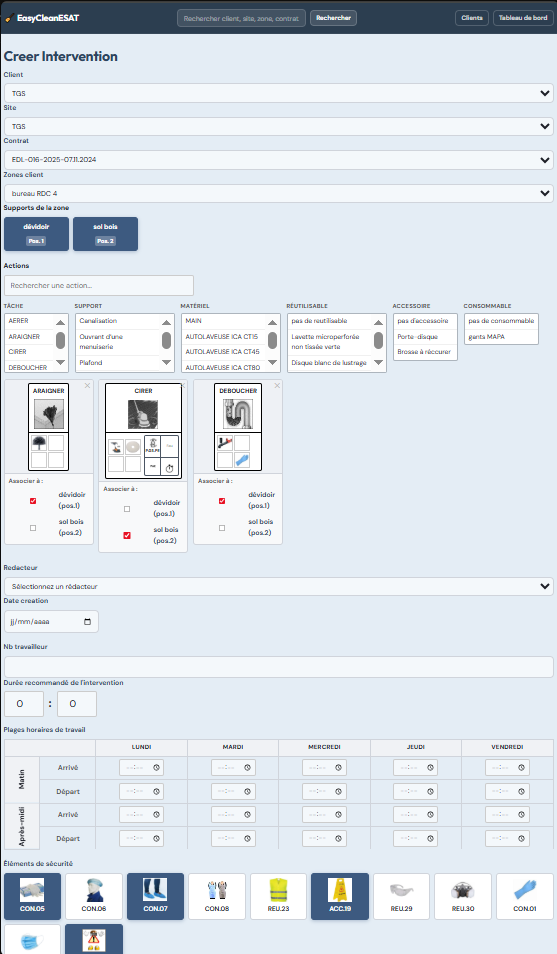
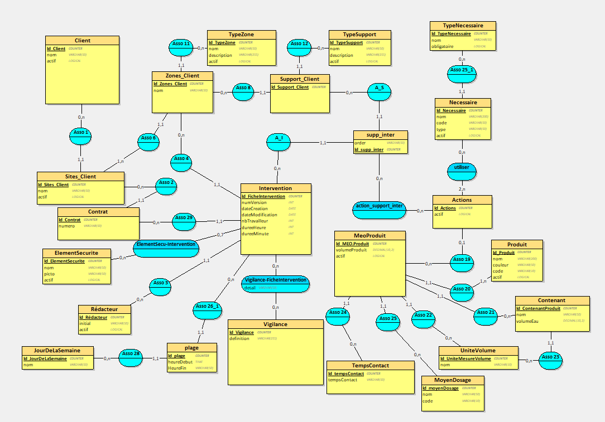

# EasyCleanesat

Application web de gestion des fiches d'intervention de nettoyage, développée pour l'**ESAT ANAIS de DOMFRONT-EN-POIRAIE**.

---

## Présentation

EasyCleanesat permet au personnel de l'ESAT de créer, consulter et modifier des **fiches d'intervention de nettoyage** de manière structurée et centralisée. L'application couvre l'ensemble du cycle de vie d'une intervention : de la sélection du client et du site jusqu'aux détails opérationnels (actions, nécessaires, éléments de sécurité, plages horaires).

---

## Fonctionnalités

### Gestion des clients
- Liste et détail des clients, sites et contrats
- Gestion des zones client avec types de zones et types de support
- Gestion des supports client (avec pictogrammes)
- Recherche universelle (clients, sites, zones, contrats)

### Gestion des interventions
- Création d'une fiche d'intervention avec sélection en cascade : **client → site → contrat → zone**
- Modification d'une fiche existante avec versioning automatique (N+1) et date de modification
- Gestion des **actions associées** à chaque support, filtrées par nécessaire
- Gestion des **éléments de sécurité** et **vigilances** rattachés à l'intervention
- Tableau des **plages horaires** (arrivée / départ, matin et après-midi, par jour de la semaine)

### Gestion des produits
- Catalogue de produits avec code couleur
- Gestion des contenants, moyens de dosage, temps de contact, unités de mesure
- Mise en œuvre produit (MEO Produit)

### Gestion des actions et nécessaires
- Référentiel des tâches et nécessaires (matériels requis par action)
- Administration des actions avec association aux MEO Produit

### Administration générale
- Menu d'administration centralisé
- Gestion des rédacteurs, vigilances, éléments de sécurité, jours de la semaine

---

## Captures d'écran

### Formulaire de création d'intervention



### Modèle Conceptuel de Données (MCD)



---

## Stack technique

| Composant | Technologie |
|---|---|
| Langage | PHP 8.1 |
| Framework back-end | Symfony 6.4 |
| ORM | Doctrine (avec migrations) |
| Moteur de templates | Twig |
| JavaScript front-end | Symfony UX / Stimulus |
| Base de données | MySQL 8.0 |
| Serveur local | XAMPP (Apache 2.4) |
| Gestion de versions | Git / GitHub |
| IDE | Visual Studio Code |

---

## Installation

### Prérequis

- PHP >= 8.1
- Composer
- MySQL 8.0
- Symfony CLI (optionnel)
- Node.js (pour les assets)

### Étapes

```bash
# 1. Cloner le dépôt
git clone https://github.com/Boniben/easycleanesat.git
cd easycleanesat

# 2. Installer les dépendances PHP
composer install

# 3. Configurer la base de données
# Copier et adapter le fichier .env
cp .env .env.local
# Modifier DATABASE_URL dans .env.local :
# DATABASE_URL="mysql://root:@127.0.0.1:3306/easycleanesat"

# 4. Créer la base de données et exécuter les migrations
php bin/console doctrine:database:create
php bin/console doctrine:migrations:migrate

# 5. (Optionnel) Charger les données de test
php bin/console doctrine:fixtures:load

# 6. Lancer le serveur de développement
symfony server:start
# ou
php -S localhost:8000 -t public/
```

L'application est accessible à l'adresse : `http://localhost:8000`

---

## Structure du projet

```
easycleanesat/
├── assets/
│   └── controllers/          # Contrôleurs Stimulus (JS dynamique)
│       ├── intervention_form_controller.js   # Filtres en cascade (création)
│       └── supp_inter_controller.js          # Gestion zones/actions (édition)
├── docs/                     # Documentation et captures d'écran
├── migrations/               # Migrations Doctrine
├── src/
│   ├── Controller/           # Contrôleurs Symfony
│   │   ├── ApiController.php             # Endpoints AJAX (filtres dynamiques)
│   │   ├── InterventionController.php    # CRUD interventions
│   │   └── ...
│   ├── Entity/               # Entités Doctrine
│   └── Form/                 # Types de formulaires Symfony
├── templates/                # Templates Twig
└── public/                   # Point d'entrée (index.php)
```

---

## Équipe

| Développeur | Module | User Stories |
|---|---|---|
| [Benjamin Boniface](https://github.com/Boniben) | Produits + Navigation | US-P1 à US-P6, US-T3 |
| [Marius Margueray](https://github.com/MamaLeVrai) | Intervention | US-I1 à US-I6 |
| [Estelle Bihel](https://github.com/EstelleBihel) | Clients | US-C1 à US-C9 |
| [Max Tribouillard](https://github.com/MaxTribouillard) | Actions / Nécessaires | US-A1, US-A2, US-T2 |

---

## Contexte

Projet réalisé dans le cadre du **BTS SIO option SLAM** (Services Informatiques aux Organisations — Solutions Logicielles et Applications Métiers), en formation au lycée, sur une période de 3 mois (janvier–avril 2026).

Client : **ESAT ANAIS de DOMFRONT-EN-POIRAIE**
Chef de projet : Benjamin Boniface
